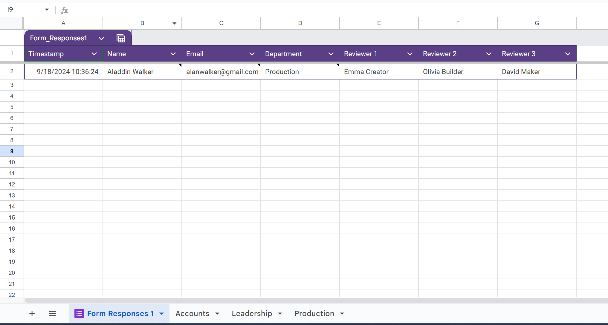

# Google Sheets Peer Review Assigner

This project is a Google Apps Script that works with Google Sheets and Forms. It does one main thing:

When someone submits a form, the script automatically picks 3 random people from the same department to review their work.

## What it does

1. Waits for a new form submission
2. Checks which department the person is from
3. Finds other people in that department
4. Randomly chooses 3 of them as reviewers
5. Adds these reviewers to the spreadsheet

## How to use it

1. Ensure you have a Google Spreadsheet with sheets for each department and a 'Form Responses 1' sheet
2. Create a Google Form linked to this spreadsheet
3. In the spreadsheet, go to Extensions > Apps Script
4. Create a new file named `peer_review_assignment.gs`
5. Copy the code from this repository into the file
6. Save the project
7. Set up a trigger for the `onFormSubmit` function to run on form submission
8. Submit the form to test the automatic reviewer assignment
9. To assign reviewers to existing submissions, run the `assignReviewersToExistingResponses` function

## Example Spreadsheet and Form

You can see a live example of this system in action:

- [Example Google Form](https://docs.google.com/forms/d/e/1FAIpQLSeOhod3qsxggqbLkkkPfvL4Cpcmegp3N1AZEGHDH5OKkjK8Sw/viewform?usp=sf_link)
- [Example Google Spreadsheet](https://docs.google.com/spreadsheets/d/154_ENg4jUK0EjkEe0MQm__Lk_FovAA0rF91b8tSFlRc/edit?usp=sharing)

Here's what your spreadsheet might look like after setup and a few submissions:

## Note

This was made for a specific client's needs. You might need to change some things to make it work for you.

## Files

- `peer_review_assignment.gs`: The main script that assigns reviewers
- `peer_review_setup.gs`: A script to set up test data (not used in the real version)

Feel free to use and change this code for your own projects!

## Requirements

- Google account
- Google Sheets
- Google Forms
- Google Apps Script